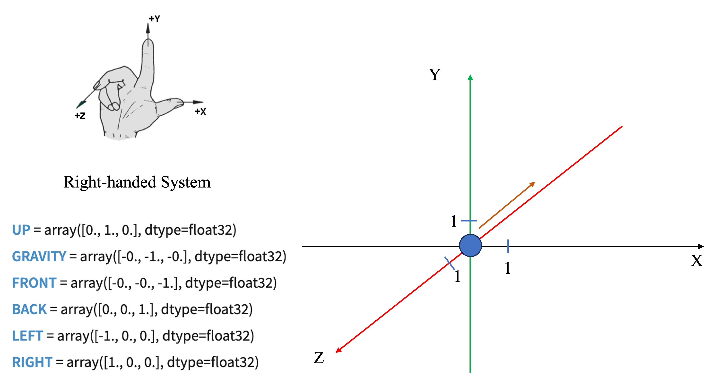

# Spatial-AST

This repo hosts the code and models of "[BAT: Learning to Reason about Spatial Sounds with Large Language Models](https://arxiv.org/abs/2402.01591)" [Accepted by ICML 2024 [bib](https://github.com/zszheng147/Spatial-AST#citation)].


<p align="center">
  
</p>

## Installation
```
conda env create -f environment.yml
bash timm_patch/patch.sh
```

## Data Preparation
### AudioSet (Anechoic Audio Source)
We provide `Balanced train` and `Evaluation` set for your convenience. You can download from [SpatialAudio](https://huggingface.co/datasets/zhisheng01/SpatialAudio/tree/main/SpatialSoundQA/AudioSet). 
For the `Unbalanced train` set, please refer to [Official AudioSet](https://research.google.com/audioset/download.html).

Metadata can be downloaded from [metadata](https://huggingface.co/datasets/zhisheng01/SpatialAudio/tree/main/SpatialSoundQA/AudioSet/metadata).
```
AudioSet
├── balanced_train
│   └── audio
│   │   ├── Y00M9FhCet6s.wav
│   │   ├── Y00mE-lhe_R8.wav
│   │   ├── ...
├── eval
│   └── audio
│   │   ├── Y007P6bFgRCU.wav
│   │   ├── Y00AGIhlv-w0.wav
│   │   ├── ...
```
#### Weights
Please refer to [weights-generation](https://github.com/zszheng147/Spatial-AST/blob/main/data/audioset-weight/gen_weight.py) or use [the one](https://huggingface.co/datasets/zhisheng01/SpatialAudio/tree/main/SpatialSoundQA/AudioSet/metadata/weights) we provided.

### Reverberation
Please visit [mp3d_reverberation](https://huggingface.co/datasets/zhisheng01/SpatialAudio/blob/main/SpatialSoundQA/mp3d_reverb.zip) and download manually. Below is an example of the directory structure of the reverberation data.
```bash
/path/to/reverb_root
├── train_reverberation.json
├── eval_reverberation.json
├── binaural
│   ├── 17DRP5sb8fy
│   │   ├── 0.npy
│   │   ├── 10.npy
│   │   ├── 17DRP5sb8fy.json
│   │   ├── ...
│   ├── 1LXtFkjw3qL
│   │   ├── 0.npy
│   │   ├── 10.npy
│   │   ├── 1LXtFkjw3qL.json
│   │   ├── ...
├── mono
│   ├── 17DRP5sb8fy
│   ├── ...
```
We use **Right-handed System** for coordinate annotation. 
 

## Train a new model
```bash
reverb_type=binaural # or mono / ambisonics (will be supported soon)
bash scripts/finetune-20k.sh $reverb_type
# bash scripts/finetune-2m.sh $reverb_type (if you do have 2M AudioSet data)
```

## Inference
We provide a finetuned [checkpoint](https://huggingface.co/datasets/zhisheng01/SpatialAudio/blob/main/SpatialAST/finetuned.pth).
You can do inference by 
```bash
bash scripts/inf.sh

# [11:38:56] Test:  [ 0/34]  eta: 0:02:28    time: 4.3705  data: 1.5862  max mem: 3805
# [11:39:15] Test:  [33/34]  eta: 0:00:00    time: 0.5546  data: 0.0026  max mem: 3850
# [11:39:15] Test: Total time: 0:00:23 (0.6922 s / it)
# [11:39:22] mAP: 0.497411
# [11:39:23] Accuracy of the network on the 17148 test images: 0.4974
# [11:39:23] distance accuracy: 67.62
# [11:39:23] doa error (20 degree): 24.21
# [11:39:23] doa angular error: 18.00
```
## TODO
The TODOs left will be completed before the end of June 2024.
- [x] Environment setup
- [x] Upload pretrained weights
- [x] Fix numba output bug
- [x] Update training data
- [ ] Replace tensorboard with W&B
- [ ] Inference colab

## Citation
```
@article{zheng2024bat,
  author    = {Zheng, Zhisheng and Peng, Puyuan and Ma, Ziyang and Chen, Xie and Choi, Eunsol and Harwath, David},
  title     = {BAT: Learning to Reason about Spatial Sounds with Large Language Models},
  journal   = {arXiv preprint arXiv:2402.01591},
  year      = {2024},
}
```
## Reference
The codebase is based on the [Audio-MAE](https://github.com/facebookresearch/AudioMAE/tree/main) repo.

## License
This project is under the CC-BY 4.0 license. See [LICENSE](LICENSE) for details.
